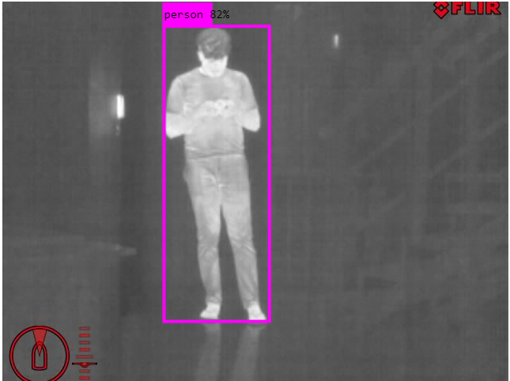
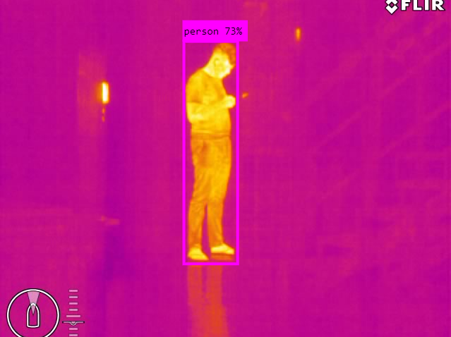
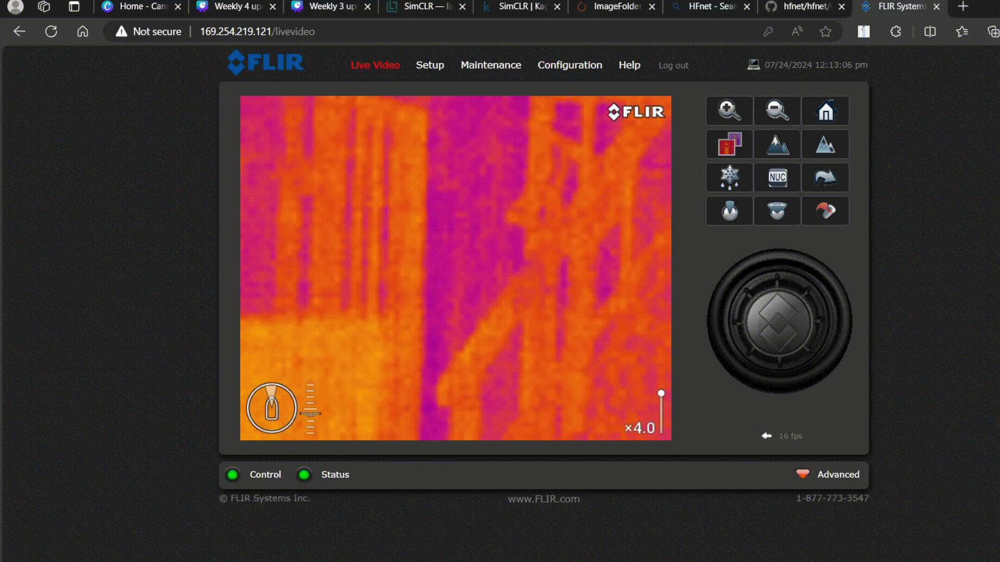
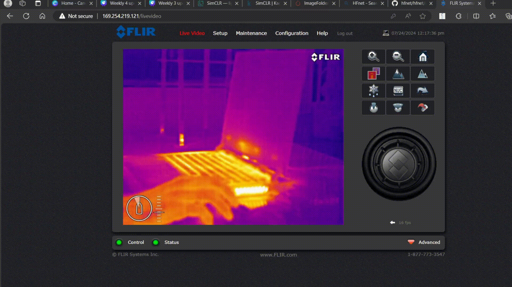

# Thermal-Imaging

## Getting Familiar with FLIR M232 Thermal Camera

The **FLIR M232** is a thermal camera used for object detection, surveillance, and real-time monitoring. It provides high-contrast thermal imaging, making it easier to detect objects even in low-light or no-light conditions.

---

## Object Detection using YOLOv3

We utilize **YOLOv3 (You Only Look Once v3)** for real-time **object detection** in thermal images. YOLOv3 is well-suited for detecting humans and objects even under challenging lighting conditions.

### Sample Object Detection Outputs:

*Figure 1: Object Detection in Thermal Image - Example 1*

*Figure 2: Object Detection in Thermal Image - Example 2*

---

## Thermal Camera Video Captures

Videos captured using the **FLIR M232 thermal camera** demonstrate how **humans can be detected easily** due to their heat signature. Below are examples of thermal video outputs:

*Figure 3: Thermal Camera Capturing Human Detection in Real-Time*

*Figure 4: Thermal Camera Showing Thermal Persistence Effect (Heat Signature Remains After Object Moves)*

The second video (**Figure 4**) illustrates an important property of thermal imaging:  
➡ **When the laptop is lifted from the table, the thermal signature remains visible** on the surface for a short period.  

---

### Limitations of Thermal Cameras

While thermal cameras are highly effective in detecting objects based on heat signatures, they have certain drawbacks:

- **Thermal Persistence Effect**: When an object moves **very recently**, its thermal signature can still be visible for a short period.  
  - *Example:* As shown in **Figure 4**, after lifting a laptop off a table, the **heat imprint remains visible** for a while before dissipating. This effect, known as **thermal persistence**, can sometimes create misleading detections.
- **Material Dependence**: Some objects with **low emissivity** (e.g., metal surfaces) may not retain heat as effectively, leading to **less distinct detections**.

Despite these limitations, **combining thermal imaging with RGB cameras** can enhance overall detection and tracking performance.

---

## User Cases: RGB and Thermal Camera Fusion

By **combining RGB and thermal cameras**, we can significantly enhance **object detection, night vision capabilities, and environmental perception**. This fusion technique improves robustness in low-visibility conditions.

For a deeper understanding, refer to the following research papers:

1. **RGB-D and Thermal Sensor Fusion: A Systematic Literature Review**  
   📄 [Read the paper](https://arxiv.org/pdf/2305.11427)

2. **Enhanced Thermal-RGB Fusion for Robust Object Detection (CVPRW 2023)**  
   📄 [Read the paper](https://openaccess.thecvf.com/content/CVPR2023W/PBVS/html/Ahmar_Enhanced_Thermal-RGB_Fusion_for_Robust_Object_Detection_CVPRW_2023_paper.html)

---
